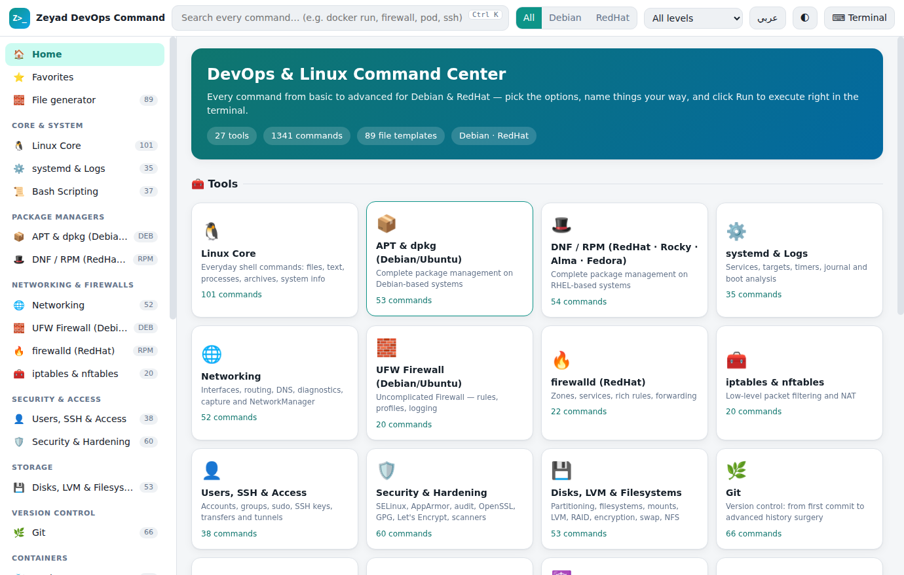
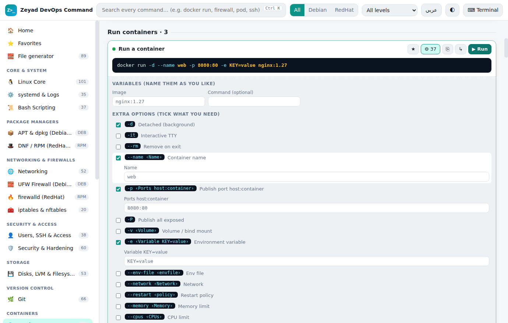
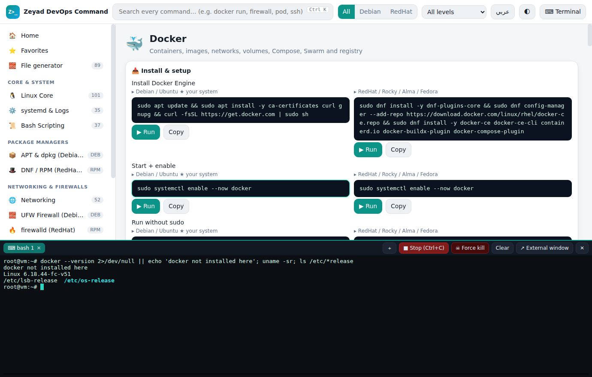
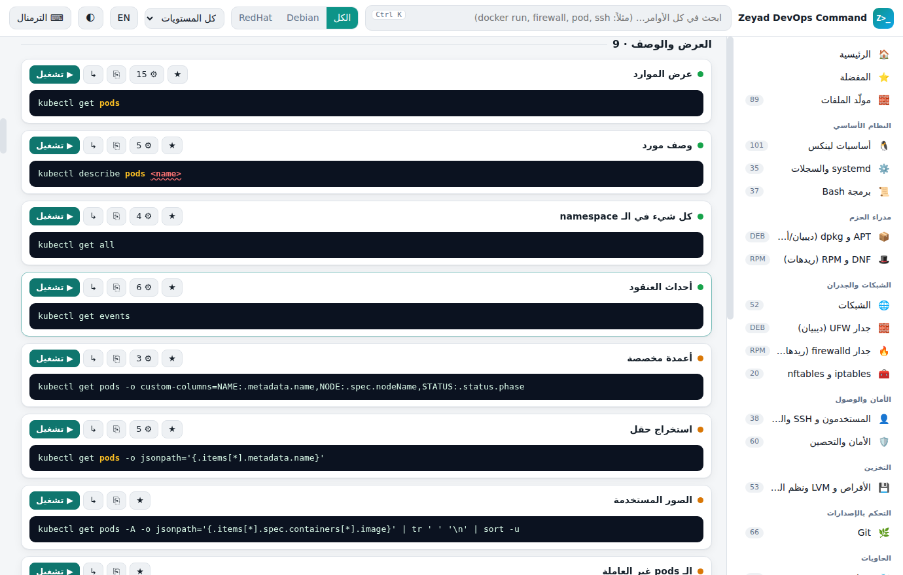

<div align="center">

# ⚙️ Zeyad DevOps Command

**A bilingual (English / العربية) DevOps & Linux command center with a real built-in terminal.**
1,341 commands from basic to advanced · Debian & RedHat · pick options, name things your way, click to run.

[](LICENSE)


**English** · [العربية](README.ar.md)



</div>

---

## Table of contents

- [Why this exists](#why-this-exists)
- [Features](#features)
- [Screenshots](#screenshots)
- [Install & run](#install--run)
- [What's inside](#whats-inside)
- [How to use it](#how-to-use-it)
- [Build from source](#build-from-source)
- [Project structure](#project-structure)
- [Adding commands (for contributors)](#adding-commands-for-contributors)
- [Security notes](#security-notes)
- [Roadmap ideas](#roadmap-ideas)
- [Contributing](#contributing)
- [License](#license)

## Why this exists

Cheat sheets are static. Real work is not: you need *your* container name, *your* namespace, and one extra flag you only use twice a year.

Zeyad DevOps Command turns every command into a small **builder**. Tick the options you need, fill in your own names, watch the final command update live, then run it in the built-in terminal with one click — no copy/paste, no retyping.

## Features

- **1,341 commands in 27 tools**, tagged 🟢 basic (398) · 🟠 intermediate (781) · 🔴 advanced (162).
- **Debian *and* RedHat** — APT/dpkg, DNF/rpm, UFW, firewalld, AppArmor, SELinux, `netplan`, NetworkManager… each with its own complete section, plus a Debian / RedHat filter.
- **Command builder** on every command:
  - **Variables** you name yourself (container name, port, namespace, file…).
  - **Options / flags** you tick on and off (`-d`, `--restart`, `--memory`, `-n <namespace>`…), with inline fields for flags that take a value.
  - **Extras:** `sudo`, extra arguments, `| pipe`, `> redirect`, `&` background.
  - Missing variables are highlighted and block execution until filled.
- **Real terminal (PTY)** built in — colors, tabs, interactive programs, resizable dock, copy/paste.
- **Click to run** — click a command and it executes in the terminal immediately (no Enter needed).
- **Working Stop button** — `■ Stop` sends Ctrl+C; `☠ Force kill` kills even processes that ignore Ctrl+C.
- **Safety net** — destructive commands (`rm -r`, `prune`, `--force`, `drop`, `destroy`, …) ask for confirmation first.
- **File generator** — 89 ready templates (Dockerfile, Compose, Kubernetes/OpenShift/Argo YAML, Ansible, Terraform, Jenkinsfile, GitHub Actions, systemd, Nginx…) with fillable fields, live preview, save to disk.
- **Fully bilingual UI** — English (default) and Arabic with proper RTL; every command title, option description and section is translated. Search works in both languages.
- **Search everything** (`Ctrl+K`) across titles, commands and option descriptions.
- **Favorites** (export as a `.sh` file), recently-run history, light/dark theme.
- **Install steps for every tool**, separated for Debian and RedHat.
- **Offline & private** — no telemetry, no network calls of its own.

## Screenshots

| Command builder | Built-in terminal |
|---|---|
|  |  |

| Arabic UI (RTL) |
|---|
|  |

## Install & run

### Download

Grab the latest `Zeyad-DevOps-Command-<version>-x86_64.AppImage` from the [**Releases**](../../releases) page, then:

```bash
chmod +x Zeyad-DevOps-Command-*-x86_64.AppImage
./Zeyad-DevOps-Command-*-x86_64.AppImage
```

### Requirements

| Requirement | Notes |
|---|---|
| Linux **x86_64** with a desktop session | Built and tested on Debian-family; RedHat-family should work the same |
| **FUSE 2** to launch an AppImage | See below if you get `libfuse.so.2` errors |
| `python3` **or** `script` (util-linux) | Used by the built-in terminal; present on practically every distro |

**If you see `dlopen(): error loading libfuse.so.2`:**

```bash
# Ubuntu 24.04+ / Debian 13+
sudo apt install -y libfuse2t64
# Older Ubuntu / Debian
sudo apt install -y libfuse2
# RedHat / Rocky / Alma / Fedora
sudo dnf install -y fuse fuse-libs
```

Or skip FUSE entirely:

```bash
./Zeyad-DevOps-Command-*-x86_64.AppImage --appimage-extract-and-run
```

## What's inside

| Tool | Distro | Commands | What it covers |
|---|---|---:|---|
| 🐧 Linux Core | Debian + RedHat | 101 | Everyday shell commands: files, text, processes, archives, system info |
| 📦 APT & dpkg (Debian/Ubuntu) | Debian | 53 | Complete package management on Debian-based systems |
| 🎩 DNF / RPM (RedHat · Rocky · Alma · Fedora) | RedHat | 54 | Complete package management on RHEL-based systems |
| ⚙️ systemd & Logs | Debian + RedHat | 35 | Services, targets, timers, journal and boot analysis |
| 🌐 Networking | Debian + RedHat | 52 | Interfaces, routing, DNS, diagnostics, capture and NetworkManager |
| 🧱 UFW Firewall (Debian/Ubuntu) | Debian | 20 | Uncomplicated Firewall — rules, profiles, logging |
| 🔥 firewalld (RedHat) | RedHat | 22 | Zones, services, rich rules, forwarding |
| 🧰 iptables & nftables | Debian + RedHat | 20 | Low-level packet filtering and NAT |
| 👤 Users, SSH & Access | Debian + RedHat | 38 | Accounts, groups, sudo, SSH keys, transfers and tunnels |
| 🛡️ Security & Hardening | Debian + RedHat | 60 | SELinux, AppArmor, audit, OpenSSL, GPG, Let's Encrypt, scanners |
| 💾 Disks, LVM & Filesystems | Debian + RedHat | 53 | Partitioning, filesystems, mounts, LVM, RAID, encryption, swap, NFS |
| 🌿 Git | Debian + RedHat | 66 | Version control: from first commit to advanced history surgery |
| 🐳 Docker | Debian + RedHat | 93 | Containers, images, networks, volumes, Compose, Swarm and registry |
| 🦭 Podman · Buildah · Skopeo | Debian + RedHat | 26 | Daemonless containers (default on RedHat), pods, Quadlet, image tools |
| ☸️ Kubernetes (kubectl · kubeadm) | Debian + RedHat | 103 | Full cluster operations: workloads, networking, config, RBAC, nodes, debugging, cluster setup |
| ⎈ Helm · Minikube · kind · k3s | Debian + RedHat | 40 | Package manager for Kubernetes and local clusters |
| 🔴 OpenShift (oc) | Debian + RedHat | 111 | Projects, apps, builds, routes, SCC, operators, nodes and cluster administration |
| 🐙 Argo CD · Rollouts · Workflows | Debian + RedHat | 50 | GitOps delivery, progressive rollouts and workflow engine |
| 🅰️ Ansible | Debian + RedHat | 40 | Ad-hoc commands, playbooks, roles, Galaxy, Vault, inventory and lint |
| 🏗️ Terraform · OpenTofu | Debian + RedHat | 37 | Infrastructure as Code: init, plan, apply, state, workspaces, modules, tooling |
| 🤵 Jenkins | Debian + RedHat | 40 | Server install, CLI, REST API, pipelines, agents, backup and troubleshooting |
| 📈 Monitoring & Logging | Debian + RedHat | 38 | Prometheus, Grafana, Alertmanager, Loki, ELK, exporters |
| ☁️ Cloud CLIs (AWS · Azure · GCP) | Debian + RedHat | 42 | Core commands for the three major clouds |
| 🕸️ Web Servers & Databases | Debian + RedHat | 45 | Nginx, Apache, HAProxy, MySQL/MariaDB, PostgreSQL, MongoDB, Redis, queues |
| 🔁 CI/CD & DevOps Tools | Debian + RedHat | 41 | GitHub CLI, GitLab, Flux, Tekton, Packer, Kustomize, Skaffold, SonarQube, Nexus |
| 🖥️ Virtualization (KVM · Vagrant · LXC) | Debian + RedHat | 24 | libvirt, QEMU, VirtualBox, Vagrant, cloud-init, LXD |
| 📜 Bash Scripting | Debian + RedHat | 37 | Variables, conditions, loops, functions, error handling and script patterns |

**Total: 27 tools · 1,341 commands.**

Plus **89 file templates**: Docker (Dockerfiles for Node, Python, Go, Java, PHP, .NET, Rust, Ruby, Nginx; Compose stacks; Swarm), Kubernetes (Deployment, Service, Ingress, ConfigMap, Secret, PVC/PV, StatefulSet, DaemonSet, Job, CronJob, HPA, NetworkPolicy, RBAC, Kustomize, cert-manager…), Helm, OpenShift (Route, BuildConfig, DeploymentConfig, Template, SCC), Argo CD / Rollouts / Workflows, Ansible, Terraform (AWS, Azure, GCP, backend, VPC), CI/CD (Jenkinsfile, GitHub Actions, GitLab CI, Tekton), Linux (systemd, Nginx, Apache, HAProxy, logrotate, cloud-init, Vagrantfile, Makefile), Bash scripts and Prometheus configs.

## How to use it

**Run a command in one click.** Click any command (or its **▶ Run** button). It runs in the terminal immediately.

**Customize it first.** Press **⚙** on a card:

1. Fill the **variables** — type your own container name, port, namespace…
2. Tick the **extra options** you need. Options that take a value show an input right under them.
3. Add **command extras** — `sudo`, extra args, a pipe, a redirect, background.
4. The preview updates live. Yellow = your values, cyan = options. Click **▶ Run**, **⎘ Copy**, or **↳ Paste** (put it in the terminal without executing).

**Terminal.** `⌨ Terminal` (or ``Ctrl+` ``) opens the dock. Drag its top edge to resize. Use **＋** for more tabs.

| Action | How |
|---|---|
| Interrupt the running program | `■ Stop (Ctrl+C)` button, or press `Ctrl+C` |
| Force-kill a stuck program | `☠ Force kill` button |
| Copy / paste in terminal | `Ctrl+Shift+C` / `Ctrl+Shift+V`, or right-click |
| Open a separate system terminal | `↗ External window` |

**Keyboard shortcuts**

| Shortcut | Action |
|---|---|
| `Ctrl+K` | Focus search |
| ``Ctrl+` `` | Show / hide terminal |
| `Esc` | Clear search / close dialog |

**Filters.** The header lets you filter by **Debian / RedHat** and by **level** (basic / intermediate / advanced). Switch language with the **EN / عربي** button — the app starts in English.

**File generator.** Open **🧱 File generator**, pick a template, edit the fields, tweak the text if you like, then copy it or save it to a folder.

## Build from source

Requirements: Node.js 20+ and npm.

```bash
git clone https://github.com/zeyadzero/ZeyadDevOpsCommand.git
cd zeyad-devops-command
npm install

npm start            # run in development
npm run validate     # check every command & template (bash -n on each)
npm run dist         # build the AppImage into ./dist
```

`npm run validate` parses every command definition, builds it with defaults **and** with all options enabled, and syntax-checks the result with `bash -n`. Run it before every pull request.

## Project structure

```text
.
├── main.js                 # Electron main process: window, PTY sessions, dialogs
├── preload.js              # Safe bridge (contextIsolation) between UI and main
├── package.json
├── build/icon.png
├── scripts/validate.js     # Syntax-checks every command & template
├── docs/screenshots/
└── src/
    ├── index.html          # UI shell + styles
    ├── app.js              # UI: navigation, command cards, terminal tabs, generator, i18n
    ├── engine.js           # Command DSL parser + builder (no DOM, testable in Node)
    ├── cmds-a.js … cmds-e.js   # Command definitions (the data)
    ├── gen.js, gen2.js     # File-generator templates
    └── vendor/             # xterm.js + addons (bundled, works offline)
```

**How the terminal works:** the main process starts a small embedded Python helper that opens a pseudo-terminal and runs your `$SHELL`. Output streams to [xterm.js](https://xtermjs.org/) in the UI. If `python3` is missing it falls back to `script -qfc`. There are no native Node modules to compile.

## Adding commands (for contributors)

Commands live in `src/cmds-*.js` as plain text. Each tool is one ``T([...], `...`)`` call; each line is one command.

```text
LEVEL§English title§العنوان بالعربي§command template§option1¶option2¶…
```

| Part | Meaning |
|---|---|
| `LEVEL` | `1` basic · `2` intermediate · `3` advanced |
| `{key}` | Required variable (blocks running until filled) |
| `{key=default}` | Variable with a default value |
| `{key?}` | Optional variable (omitted when empty) |
| `{key=@a,b,c}` | Dropdown; first item is the default (start with `@,` for an optional dropdown) |
| `{key=@@LIST}` | Dropdown from a shared list in `window.OPTS` |
| `{*}` | Where ticked options are inserted (appended at the end if omitted) |
| `<<NAME>>` | Insert a shared option group from `window.MAC` (e.g. namespace / output flags for `kubectl`) |
| `flag\|English description\|وصف عربي` | One option. Flags can contain their own `{variables}` |
| `#English\|عربي` | Starts a new section |

Example:

```text
1§Run a container§تشغيل حاوية§docker run {*} {image=nginx}§-d|Detached|في الخلفية¶--name {name=web}|Container name|اسم الحاوية¶-p {ports=8080:80}|Publish port|نشر منفذ
```

Notes:

- `{...}` right after `$` or `%` (e.g. `${VAR}`, `%{http_code}`) is **not** treated as a variable.
- Inside a JS template literal write `\${` for a literal `${`.
- Every command needs both an English and an Arabic title, and every option needs both descriptions.
- Run `npm run validate` — a command that fails `bash -n` fails the check.

**Adding a generator template:** append to `src/gen2.js`:

```js
add("Category", "Name in English|الاسم بالعربي", "filename.yaml", ["name","port"], v => `...${v.name}...`);
```

## Security notes

- The terminal runs commands **with your user's privileges**. `sudo` prompts for your password in the terminal itself; the app never stores it.
- Destructive commands ask for confirmation, but **always read a command before running it**. Defaults are examples, not recommendations.
- Install commands reference the vendors' official download locations as of writing — check them before running on production servers.
- The app is fully offline. It makes no network requests of its own; links in the terminal open in your default browser.
- The Chromium sandbox switch is disabled (`--no-sandbox`) so the AppImage runs without a SUID helper; the app only loads its own bundled local files.

## Roadmap ideas

These are ideas, not promises — PRs welcome:

- ARM64 build and `.deb` / `.rpm` packages
- User-defined custom commands and import/export of favorites
- More tools (Nomad, Consul, Vault deep-dive, Istio, Cilium…)
- Additional UI languages

## Contributing

1. Fork the repo and create a branch.
2. Add or fix commands (`src/cmds-*.js`) or templates (`src/gen*.js`).
3. Run `npm run validate`.
4. Open a pull request describing the change. Screenshots help for UI changes.

Found a wrong flag or a broken install command? Please [open an issue](../../issues) with the command and your distro/version.

## License

[MIT](LICENSE) © 2026 Zeyad Hossam

*Docker, Kubernetes, Red Hat, OpenShift, Ansible, Terraform, Jenkins, Argo and other names are trademarks of their respective owners. This project is independent and not affiliated with or endorsed by them.*

Built with [Electron](https://www.electronjs.org/), [xterm.js](https://xtermjs.org/) and [electron-builder](https://www.electron.build/).
